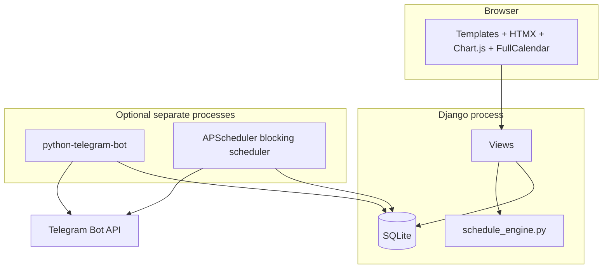

# Architecture

This document explains how Life OS is structured and how the main pieces interact. For exact URLs and fields, see [reference.md](reference.md).

## System context

Life OS is a **monolithic Django application** with:

- Server-rendered pages (templates) for the main UI.
- **HTMX** for partial updates (activities, sessions, daily plan, tide card).
- **Django REST Framework** read/write JSON endpoints consumed by **Chart.js** and **FullCalendar**.
- A **Telegram** layer: interactive commands plus **APScheduler** cron-style jobs that call the Telegram HTTP API.

Typical **development** runs one `runserver` process. **Telegram** mode is usually a second terminal: scheduler and bot are started via the Makefile (see [runbook.md](runbook.md)).

## Django apps

| App | Role |
|-----|------|
| `dashboard` | Models for life data, schedule validation, web UI, HTMX partials, analytics and calendar APIs, tide helpers. |
| `reminders` | Telegram webhook/status URLs, bot command handlers, APScheduler jobs for morning/evening/reminder pings. |
| `lifeos` (project package) | `settings.py`, root URL routing, WSGI. |

## Domain model (conceptual)

Core entities:

- **Activity** — concrete calendar item on a date, with category, optional time window, status, notes.
- **AIProject** / **ProjectSession** — portfolio of AI-related projects and timed work sessions (optionally linked to an activity).
- **DailyPlan** — per-day intention, review, mood/energy scores.
- **Habit**, **KiteSession** — longitudinal tracking.
- **ScheduleBlock** — recurring weekly blueprint (planner v2); validated before persistence.
- **TideEvent** — imported tide table rows for a named port (default Cabedelo).
- **TelegramReminder** — deduplication ledger for “30 minutes before” activity pings.

Relationships and choice lists are summarized in [reference.md](reference.md#data-model-summary).

## Schedule rule engine

`dashboard/schedule_engine.py` implements **ScheduleEngine**: validation of proposed `ScheduleBlock` rows against:

- Time windows (deep work, afternoon, evening physical, morning physical-only).
- Anchor days (e.g. Muay Thai), recovery day rules.
- Duration bands per activity class.
- Rules that prevent conflicting **AI domain** categories on the same day.

The UI or management flows should treat **`ValidationError` / result objects** as the contract before saving blocks. See module docstring in `schedule_engine.py` for usage.

## Tides and wind

- **TideEvent** data is loaded from JSON via `import_tides` (see runbook).
- `dashboard/services/tide_service.py` builds payloads for the dashboard tide card, including **kite-oriented heuristics** when **wind speed (knots)** is supplied (threshold constant `WIND_KITE_KNOTS` in code). Wind may be passed from the client or other sources depending on UI wiring.

## External dependencies (runtime)

- **CDN assets** in templates: Bootstrap, HTMX, Chart.js, FullCalendar, Font Awesome, Alpine.js, etc. (see `dashboard/templates/dashboard/base.html`).
- **Telegram Bot API** (`https://api.telegram.org/...`) when bot token and chat id are set.

No Redis/Celery are required in the current codebase; scheduling uses APScheduler in-process.

## Extension points (where to add behavior)

| Goal | Likely location |
|------|-----------------|
| New dashboard page | `dashboard/views.py`, `dashboard/urls.py`, templates under `dashboard/templates/dashboard/`. |
| New chart or calendar feed | DRF view in `views.py` + `static/js/charts.js` or planner template. |
| New model | `dashboard/models.py`, migrations, admin, serializers if exposed as API. |
| New bot command | `reminders/bot.py` (register handler), reuse models in `dashboard`. |
| New scheduled job | `reminders/tasks.py` (cron or interval), keep timezone `America/Fortaleza`. |

## Design stance

Life OS optimizes for **clarity and operability for a single operator**, not horizontal multi-user scale. SQLite and synchronous Django views are intentional trade-offs; moving to PostgreSQL or async workers would be an explicit architecture change.
